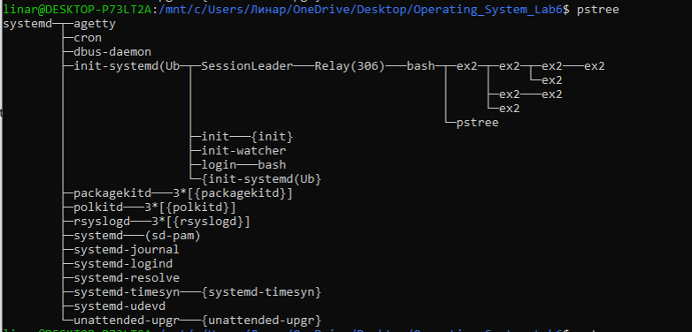
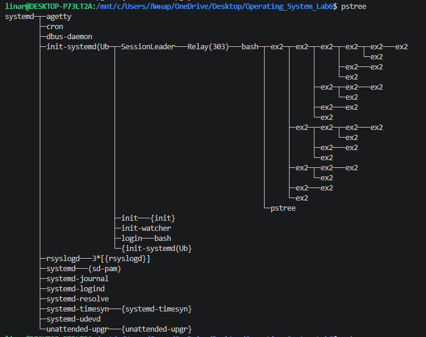

pstree call with N = 3
The total number of processes is 8. Every time fork() is called all existing processes create one more child process.

pstree call with N = 5
Here we can see much more processes - 32. By the same logic: each process creates new one with fork().